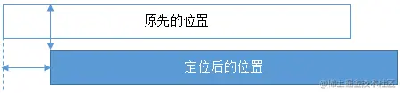
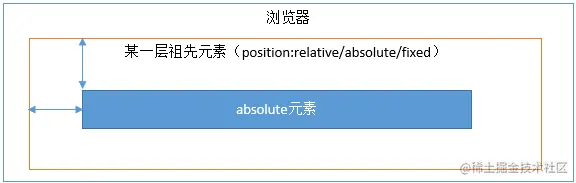
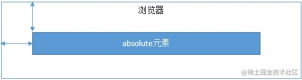

### flex的理解
Flex是FlexibleBox的缩写，意味“弹性布局”，任何一个容器都可以指定为Flex布局。采用Flex布局的元素，称为Flex容器，它的子元素自动成为容易成员，称为Flex项目。设置Flex布局以后，子元素的float、clear和vertical-align属性将失效。

6个属性设置在容器上：
- flex-direction属性决定主轴的方向（即项目的排列方向）。
- flex-wrap属性定义，如果一条轴线排不下，如何换行。
- flex-flow属性是flex-direction属性和flex-wrap属性的简写形式，默认值为row nowrap；
- justify-content属性定义了项目在主轴上的对齐方式（flex-start、flex-end、center、space-between、space-around）。
- align-items属性定义项目在交叉轴上如何对齐（flex-start、flex-end、center）。
- align-content属性定义了多根轴线的对齐方式。如果项目只有一根轴线，该属性不起作用（flex-start、flex-end、center、space-between、space-around）。

6个属性设置在项目上：
- order属性定义项目的排列顺序。数值越小，排列越靠前，默认为0。
- flex-grow属性定义项目的放大比例，默认为0，即如果存在剩余空间，也不放大。
- flex-shrink属性定义了项目的缩小比例，默认为1，即如果空间不足，该项目将缩小。
- flex-basis属性定义了在分配多余空间之前，项目占据的主轴空间。浏览器根据这个属性，计算主轴是否有多余空间。它的默认值为auto，即项目的本来大小。
- flex属性是flex-grow，flex-shrink和flex-basis的简写，默认值为0 1 auto。
- align-self属性允许单个项目有与其他项目不一样的对齐方式，可覆盖align-items属性。默认值为auto，表示继承父元素的align-items属性，如果没有父元素，则等同于stretch（flex-start、flex-end、center等）。

### 定位与浮动
**浮动的定义：**非IE浏览器下，容器不设高度且子元素浮动时，容器高度不能被内容撑开。 此时，内容会溢出到容器外面而影响布局。这种现象被称为浮动（溢出）。

**浮动的工作原理：**
- 浮动元素脱离文档流，不占据空间（引起“高度塌陷”现象）
- 浮动元素碰到包含它的边框或者其他浮动元素的边框停留

**浮动元素引起的问题**
- 父元素的高度塌陷
- 与浮动元素同级的非浮动元素会跟随其后
- 若非第一个元素浮动，则该元素之前的元素也需要浮动，否则会影响页面显示的结构

**清除浮动的方式：**
- 添加一个额外的空div标签，并添加clear:both样式
- 包含浮动元素的父级标签添加overflow:hidden或者overflow:auto
- 使用 :after 伪元素。由于IE6-7不支持 :after，使用 zoom:1 触发 hasLayout（描述元素的布局和渲染行为，具有hasLayout可以出发IE清除发动的行为，只在低版本IE浏览器中）
```
.clearfix:after{
    content: "\200B";
    display: table; 
    height: 0;
    clear: both;
  }
  .clearfix{
    *zoom: 1;
  }
```
- 给父级div定义height属性

**使用clear属性清楚浮动的原理**
clear的解释：元素盒子的彼岸不能和前面的浮动元素相邻，对元素设置clear属性是为了避免浮动元素对该元素的影响，而不是清除掉浮动。

> 需要注意 clear 属性指的是元素盒子的边不能和前面的浮动元素相邻，注意这里“前面的”3个字，也就是clear属性对“后面的”浮动元素是不闻不问的。考虑到float属性要么是left，要么是right，不可能同时存在，同时由于clear属性对“后面的”浮动元素不闻不问，因此，当clear:left有效的时候，clear:right必定无效，也就是此时clear:left等同于设置clear:both；同样地，clear:right如果有效也是等同于设置clear:both。由此可见，clear:left和clear:right这两个声明就没有任何使用的价值，至少在CSS世界中是如此，直接使用clear:both吧。

```
.clear::after{  content:'';  display: block;   clear:both;}
clear属性只有块级元素才有效的，而::after等伪元素默认都是内联水平，这就是借助伪元素清除浮动影响时需要设置display属性值的原因。
```

### BFC的理解
BFC（会计格式化上下文）是一个独立的渲染区域，是布局过程中生成会计盒子的区域，不会影响其他的元素。

**创建BFC的条件：**
- 根元素：body；
- 元素设置浮动：float 除 none 以外的值；
- 元素设置绝对定位：position (absolute、fixed)；
- display 值为：inline-block、table-cell、table-caption、flex等；
- overflow 值为：hidden、auto、scroll；

**BFC的特点：**
- 垂直方向上，自上而下排列，和文档流的排列方式一致。
- Box垂直方向的距离由margin决定。属于同一个BFC的两个相邻Box的margin会发生重叠
- BFC区域不会与浮动的容器发生重叠
- 计算BFC的高度时，需要计算浮动元素的高度
- BFC是独立的容器，容器内部元素不会影响外部元素
- 每个元素的左margin值和容器的左border相接触

**BFC的作用：**
- 解决margin的重叠问题：由于BFC是一个独立的区域，内部的元素和外部的元素互不影响，将两个元素变为两个BFC，就解决了margin重叠的问题。
- 解决高度塌陷的问题：在对子元素设置浮动后，父元素会发生高度塌陷，也就是父元素的高度变为0。解决这个问题，只需要把父元素变成一个BFC。常用的办法是给父元素设置overflow:hidden。
- 创建自适应两栏布局：可以用来创建自适应两栏布局：左边的宽度固定，右边的宽度自适应。

### 什么是margin重叠问题
两个*块级元素*的上外边距和下外边距可能会合并（折叠）为一个外边距，其大小会取其中外边距值大的那个，这种行为就是外边距折叠。需要注意的是，浮动的元素和绝对定位这种脱离文档流的元素的外边距不会折叠。重叠只会出现在垂直方向。

**计算的原则：**
- 如果两者都是正数，那么就去最大者
- 如果是一正一负，就会正值减去负值的绝对值
- 两个都是负值时，用0减去两个中绝对值大的那个

**解决方案：对于折叠分为：兄弟之间重叠和父子之间重叠**

1. 兄弟之间重叠
- 底部元素变为行内盒子：display: inline-block
- 底部元素设置浮动：float
- 底部元素的position的值为absolute/fixed

2. 父子之间重叠
- 父元素加入：overflow: hidden
- 父元素添加透明边框：border:1px solid transparent
- 子元素变为行内盒子：display: inline-block
- 子元素加入浮动属性或定位

### position属性

| 属性值 | 概述 |
| ------- | ------- |
| absolute | 绝对定位，相对于static定位以外的一个父元素进行定位。|
| relative | 相对定位，相对于其原来的位置进行定位。|
| fixed | 固定定位，指定元素相对于屏幕视⼝（viewport）的位置来指定元素位置。元素的位置在屏幕滚动时不会改变，⽐如回到顶部的按钮⼀般都是⽤此定位⽅式。|
| static | 默认值 |
| inherit	 | 规定从父元素继承position属性的值 |
| sticky：黏贴定位 | 基于用户的滚动位置来定位，在 position:relative 与 position:fixed 定位之间切换；元素定位表现为在跨越特定阈值前为相对定位，之后为固定定位。这个特定阈值指的是 top, right, bottom 或 left 之一 |

1. relative： 元素的定位永远是相对于元素自身位置的，和其他元素没关系，也不会影响其他元素。


2. fixed： 元素的定位是相对于 window （或者 iframe）边界的，和其他元素没有关系。但是它具有破坏性，会导致其他元素位置的变化。


3. absolute：浏览器会递归查找该元素的所有父元素，如果找到一个设置了position:relative/absolute/fixed的元素，就以该元素为基准定位，如果没找到，就以浏览器边界定位。




### 对盒模型的理解
盒模型都是由四个部分组成的，分别是margin、border、padding和content。

标准盒模型和IE盒模型的区别在于设置width和height时，所对应的范围不同：
 - 标准盒模型的width和height属性的范围只包含了content，
 - IE盒模型的width和height属性的范围包含了border、padding和content。

可以通过修改元素的box-sizing属性来改变元素的盒模型：
 - box-sizeing: content-box表示标准盒模型（默认值）
 - box-sizeing: border-box表示IE盒模型（怪异盒模型）

 ### ::before和:after的双冒号和单冒号的区别？
 双冒号 :: 和单冒号 : 的区别在于语法规范上的变化，双冒号用于表示 CSS3 中的伪元素，而单冒号则是 CSS2 中的写法。
 - 伪元素（::）：在内容元素的前后插入额外的元素或样式，但是这些元素实际上并不在文档中生成。它们只在外部显示可见，但不会在文档的源代码中找到它们，因此，称为“伪”元素。
 - 伪类(:)：将特殊的效果添加到特定选择器上。它是已有元素上添加类别的，不会产生新的元素

 ### 单行、多行文本溢出隐藏
 ```
overflow: hidden;            // 溢出隐藏
text-overflow: ellipsis;      // 溢出用省略号显示
white-space: nowrap;         // 规定段落中的文本不进行换行
 ```

 ```
overflow: hidden;            // 溢出隐藏
text-overflow: ellipsis;     // 溢出用省略号显示
display:box;         // 作为弹性伸缩盒子模型显示。
flex-direction: column;
line-clamp:3;        // 显示的行数
 ```

 ### css常见的布局单位

1. 像素（px）
2. 百分比（%）
3. em和rem：em相对于父元素，rem相对于根元素（利用rem实现响应式布局）；
4. vw/vh：与视口窗口相关的


### CSS选择器
| 选择器 | 格式 | 优先级权重|
| ------- | ------- | ------- |
| id选择器	 | #id	| 100	|
| 类选择器	 | #classname	| 10 ｜
| 属性选择器	 | a[ref=“eee”]	| 10 |
| 伪类选择器	 | li:last-child | 10 |
| 标签选择器		 | div	| 1	|
| 伪元素	 | li:after		| 1 ｜
| 相邻兄弟选择器		 | h1+p		| 0 |
| 子选择器		 | ul>li	 | 0 |
| 后代选择器		 | li a		| 0 ｜
| 通配符选择器			 | *		| 0 |

### display的属性值
| 属性值	 | 作用 ｜
| ------- | ------- |
| none	 | 元素不显示，并且会从文档流中移除。	|
| block	 | 块类型。默认宽度为父元素宽度，可设置宽高，换行显示。	|
| inline	| 行内元素类型。默认宽度为内容宽度，不可设置宽高，同行显示。	|
| inline-block	| 默认宽度为内容宽度，可以设置宽高，同行显示。 |
| list-item	| 像块类型元素一样显示，并添加样式列表标记。	|
| table | 规定应该从父元素继承display属性的值。	|

###  display的block、inline和inline-block的区别
- block： 会独占一行，多个元素会另起一行，可以设置width、height、margin和padding属性；
- inline： 元素不会独占一行，设置width、height属性无效。但可以设置水平方向的margin和padding属性，不能设置垂直方向的padding和margin；
- inline-block： 将对象设置为inline对象，但对象的内容作为block对象呈现，之后的内联对象会被排列在同一行内。

对于行内元素和块级元素，其特点如下：

**行内元素**
- 设置宽高无效；
- 可以设置水平方向的margin和padding属性，不能设置垂直方向的padding和margin；
- 不会自动换行；

**块级元素**
- 可以设置宽高；
- 设置margin和padding都有效；
- 可以自动换行；
- 多个块状，默认排列从上到下。

### 隐藏元素的方法
- display: none：渲染树不会包含该渲染对象，因此该元素不会在页面中占据位置，也不会响应绑定的监听事件。
- visibility: hidden：元素在页面中仍占据空间，但是不会响应绑定的监听事件。
- opacity: 0：将元素的透明度设置为 0，以此来实现元素的隐藏。元素在页面中仍然占据空间，并且能够响应元素绑定的监听事件。
- position: absolute：通过使用绝对定位将元素移除可视区域内，以此来实现元素的隐藏。
- z-index: 负值：来使其他元素遮盖住该元素，以此来实现隐藏。
- clip/clip-path ：使用元素裁剪的方法来实现元素的隐藏，这种方法下，元素仍在页面中占据位置，但是不会响应绑定的监听事件。
- transform: scale(0,0)：将元素缩放为 0，来实现元素的隐藏。这种方法下，元素仍在页面中占据位置，但是不会响应绑定的监听事件。

