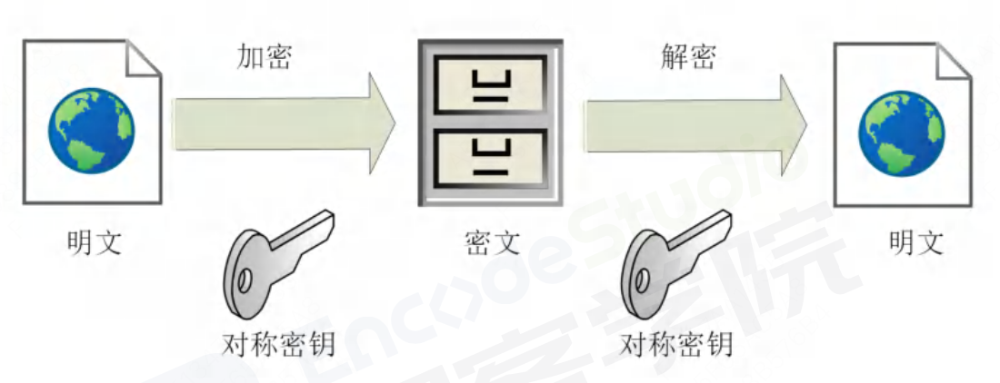
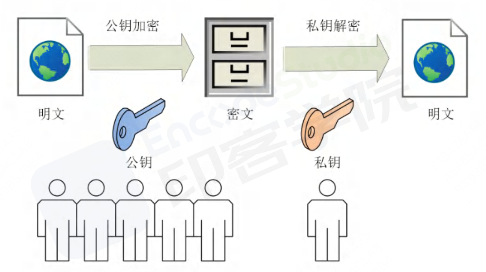
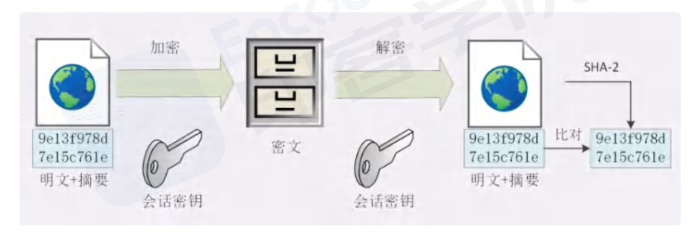

### HTTP
HTTP超文本传输协议，是实现网络通信的一种规范

HTTP常被用于Web浏览器和网站服务器之间传递信息，以明文方式发送内容，不提供任何加密的方式。

**特点：**
- 无连接、无状态：HTTP协议每次请求都是独立的，服务器都不会保留任何客户端的状态信息。这就意味着每个请求都需要携带足够的信息来完成请求，如身份验证信息等。
- 明文传输：HTTP协议是以明文的方式传输，不提供任何加密的方式；
- 灵活性：HTTP允许传输任何类型的数据对象，类型有content-type来标记；
- 基于请求和响应：HTTP协议是基于请求和响应的，客户端发送请求给服务器，服务器处理请求并返回响应给客户端。

### HTTPS
目的：为了解决HTTP不安全性；一般理解为HTTP+SSL/TLS，通过 SSL 证书来验证服务器的身份，并为浏览器和服务器之间的通信进行加密。

SSL(secure sockets layer 安全套接字协议)SSL 协议位于 TCP/IP 协议与各种应用层协议之间，为数据通讯提供安全支持。
TLS（transport layer security）

**特点：**
- 安全性：HTTPS通过使用SSL/TLS协议对通信进行加密，确保数据在传输过程中的机密性和完整性；
- 加密传输：HTTPS使用公钥加密和私钥解密的方式来进行数据传输。
- 身份验证：HTTPS使用数字证书来验证服务器的身份。

#### 加密方式

##### 对称加密
对称加密指的是加密和解密使用的密钥都是同一个，是对称的。

##### 非对称加密
非对称加密存在两个密钥，一个公钥，一个私钥。两个密钥是不用的，公钥可以公布给任何人使用，私钥则需要保密。

##### 混合加密
HTTPS通信过程中，采用的是对称加密+非对称加密。在混合加密中，对称加密用于加密和解密实际的数据，而非对称加密用于安全地传输对称加密所使用的密钥，之后再把加密后的数据和密钥发送给对方。

具体做法是：发送密文的一方使用对方的公钥进行加密处理对称的密钥，然后对方用自己的私钥解密拿到的对称的密钥。

##### 摘要算法 --- 消息体的完整性
摘要算法（MD5、SHA-1、SHA-256）：常用语数据完整性的校验，防止信息被修改。能够将任意长度的数据要缩成固定的长度，且独一无二的“摘要字符串”，就好像给这段数据生成了一个数字“指纹”。

##### 数字签名  --- 发送方发出来的
数字签名能确定消息确实是有发送方签名并发出来的，因为别人假冒不来哦发送方签名。

原理就是：公钥接密，私钥加密。

签名和公钥是完成公开，任何人都可以获取。但这个签名只有用私钥对应的公钥才能解开，拿到签名，在对比原文验证完整性。

数字签名建立在公钥加密体制基础上，是公钥加密技术的另一类应用。摘要经过私钥的加密后，便有了一个新的名字 —— 数字签名。

因为公钥谁都可以发布，怎么判断这个公钥就是你的呢？ ====》 证书验证机构

##### CA验证机构 （数字证书）
数字证书认证机构处于客服端和服务端双方都信耐的第三方认证机构的立场。
CA对公钥的签名认证要求包括序列号、用途、颁发者、有效时间等等，再把这些打成一个包在签名，完整地证明公钥关联的各种信息，形成数字证书。

非对称加密过程需要用到公钥进行加密，那么公钥从何而来？其实公钥就被包含在数字证书中，数字证书通常来说是由受信任的数字证书颁发机构 CA，在验证服务器身份后颁发，证书中包含了一个密钥对（公钥和私钥）和所有者识别信息。数字证书（ 实际就是一个 .crt 文件）被放到服务端，具有服务器身份验证和数据传输加密功能。

### HTTP和HTTPS的区别
- **安全性：**HTTP 的连接很简单，是无状态的；HTTPS 协议是由 SSL+HTTP 协议构建的可进行加密传输、身份认证的网络协议，比 HTTP 协议安全。
- **连接端口：**HTTP 标准端口是 80，而 HTTPS 的标准端口是 443。
- **费用：**HTTPS 协议需要到 CA 申请证书，一般免费证书较少，因而需要一定费用
- **传输方式：**HTTP 是超文本传输协议，信息是明文传输，而 HTTPS 是 SSL 加密传输协议。
- **工作层：**在 OSI 网络模型中，HTTP 工作于应用层，而 HTTPS 工作在传输层。
- **工作耗时：**HTTP 耗时=TCP 握手，而 HTTPS 耗时=TCP 握手+SSL 握手。
- **显示形式：**HTTP 的 URL 以http://开头，而 HTTPS 的 URL 以https://开头。
