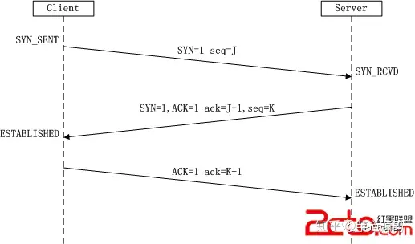
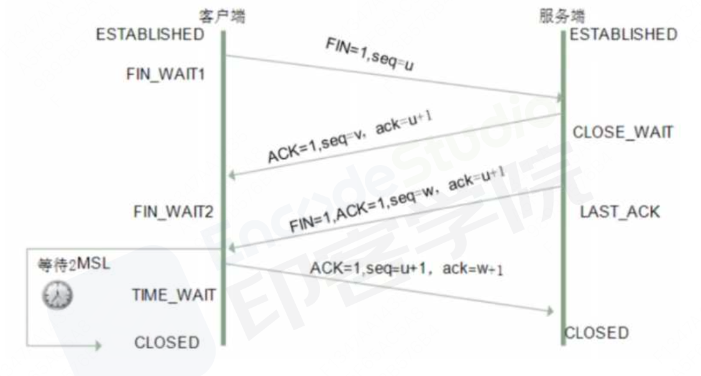

**SYN**： 是TCP连接建立过程中的同步标志。
**ACK**： 是TCP连接中的确认标志。
**FIN**： 是TCP连接的终止标志。
**Seq**：是TCP报文段中的序列号字段。序列号的作用是保证数据的有序传输和重组。

### 三次握手详解
- **第一次握手：** 客户端A将标志位SYN置为1,随机产生一个值为seq=J（J的取值范围为=1234567）的数据包到服务器，客户端A进入SYN_SENT状态，等待服务端B确认；
- **第二次握手：** 服务端B收到数据包后由标志位SYN=1知道客户端A请求建立连接，服务端B将标志位SYN和ACK都置为1，ack=J+1，随机产生一个值seq=K，并将该数据包发送给客户端A以确认连接请求，服务端B进入SYN_RCVD状态。
- **第三次握手：** 客户端A收到确认后，检查ack是否为J+1，ACK是否为1，如果正确则将标志位ACK置为1，ack=K+1，并将该数据包发送给服务端B，服务端B检查ack是否为K+1，ACK是否为1，如果正确则连接建立成功，客户端A和服务端B进入ESTABLISHED状态，完成三次握手，随后客户端A与服务端B之间可以开始传输数据了。

### 为什么需要三次握手
为了防止已失效的连接请求报文段突然又传送到了服务端，因而产生错误。

**已失效的连接请求报文段** 的产生在这样一种情况下：第一个连接请求报文段并没有丢失，而是在某个网络结点长时间的滞留了，以致延误到连接释放以后的某个时间才到达服务端。本来这是一个早已失效的报文段。但服务端收到此失效的连接请求报文段后，就误认为是客服端再次发出的一个新的连接请求。于是就向客服端发出确认报文段，同意建立连接。

### 不采用“三次握手”会怎样呢？
那么只要服务端发出确认，新的连接就建立了。由于现在客服端并没有发出建立连接的请求，因此不会理睬服务端的确认，也不会向服务端发送数据。但服务端却以为新的运输连接已经建立，并一直等待客服端发来数据。这样，服务端的很多资源就白白浪费掉了。采用“三次握手”的办法可以防止上述现象发生。例如刚才那种情况，客服端不会向服务端的确认发出确认。服务端由于收不到确认，就知道客服端并没有要求建立连接。”。主要目的防止服务端端一直等待，浪费资源。

### 为什么不是两次呢？
如果是两次握手，发送端可以缺人自己发送的信息对方能收到，也能确定对方发的包自己能收到，但是接收端智能确定对方发的包自己能收到，无法确认自己发的包对方能收到。

两次握手的话，客服端有可能因为网络阻塞等原因会发送对个请求报文，延迟到达的请求又会与服务端建立连接，浪费掉很多服务端的资源。

### 为什么建立连接是三次握手，而关闭连接却是四次挥手呢？
因为握手的时候并没有数据传输，所以服务端的SYN和ACK报文可以一起发送，但是挥手的时候有数据的传输，所以ACK和FIN报文不能同时发送，需要分两步

因为当服务端端收到客服端端的SYN连接请求报文后，可以直接发送SYN+ACK报文。其中ACK报文是用来应答的，SYN报文是用来同步的。但是关闭连接时，当服务端端收到FIN报文时，很可能并不会立即关闭SOCKET，所以只能先回复一个ACK报文，告诉客服端端，"你发的FIN报文我收到了"。只有等到我服务端端所有的报文都发送完了，我才能发送FIN报文，因此不能一起发送。故需要四步握手。

### 四次挥手详解
- 第一次挥手： 客服端发送一个FIN，用来关闭客服端到服务端的数据传送，客服端进入FIN_WAIT_1状态。
- 第二次挥手： 服务端收到FIN后，发送一个ACK给客服端，确认序号为收到序号+1（与- SYN相同，一个FIN占用一个序号），服务端进入CLOSE_WAIT状态。
- 第三次挥手： 服务端发送一个FIN，用来关闭服务端到客服端的数据传送，服务端进入LAST_ACK状态。
- 第四次挥手： 客服端收到FIN后，客服端进入TIME_WAIT状态，接着发送一个ACK给服务端，确认序号为收到序号+1，服务端进入CLOSED状态，完成四次挥手。

### 为什么客户端在第四次挥手后还会等待 2MSL
等待 2MSL 是因为保证服务端接收到了 ACK 报文，因为网络是复杂了，很有可能 ACK 报文丢失了，如果服务端没接收到 ACK 报文的话，会重新发送 FIN 报文，只有当客户端等待了 2MSL 都没有收到重发的 FIN 报文时就表示服务端是正常收到了 ACK 报文，那么这个时候客户端就可以关闭了。

### 挥手四次的原因
服务端收到客服端端开链接Fin报文后，并不会立即关闭链接，而是先发送一个ACK包告诉客服端收到关闭链接的请求，只有等服务端的所有报文都发送完毕，才发送FIN报文断开链接，因此需要四次挥手

**三次握手：C与S**
- C：我要给你发数据了
- S：好的，我准备好了，你发吧
- C：好的，收到

**四次挥手：C与S**
- C：我的数据发完了
- S：好的，我听到了，我看看收完了没
- S：好的，已经收完了，你关闭吧
- C：好的，已经关闭了