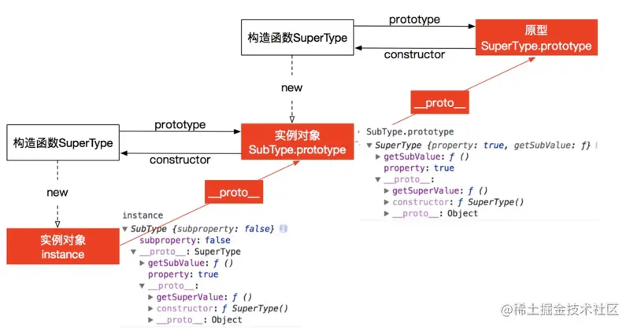
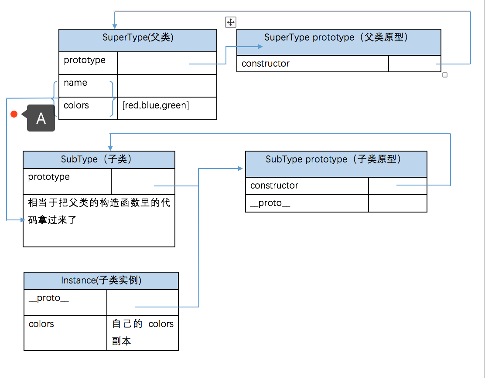
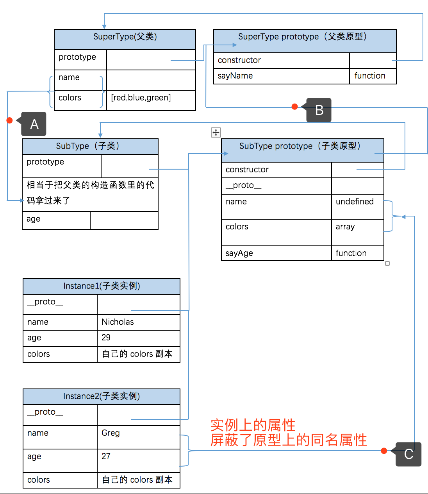
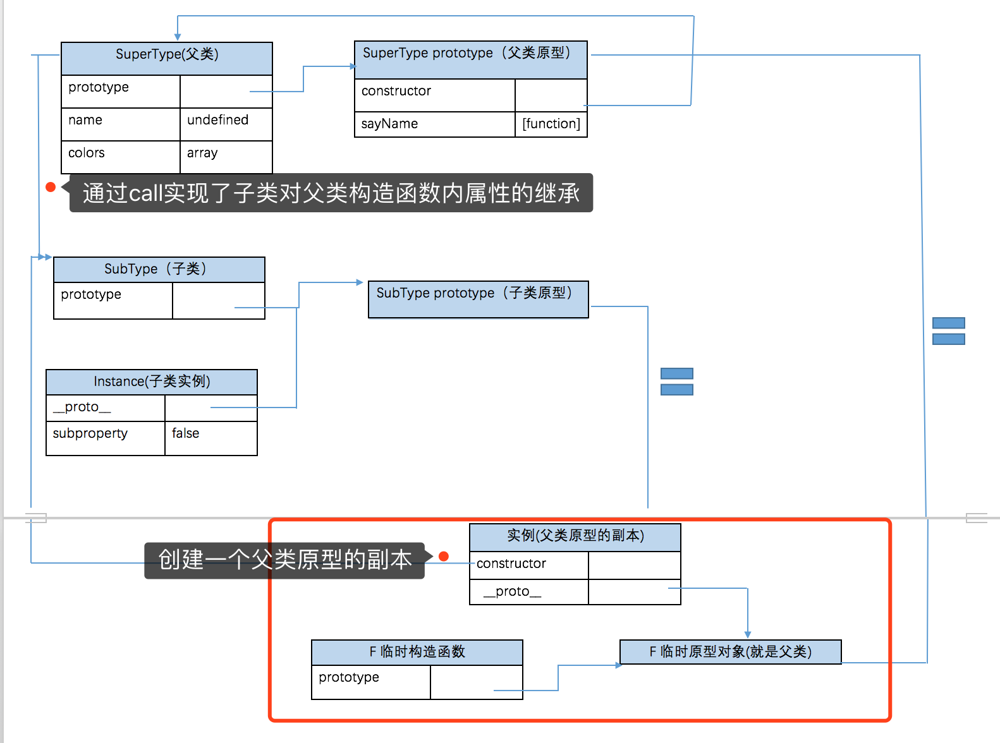

### 继承
概念： 

构造函数、原型和实例的关系： 每个构造函数都有一个原型对象，原型对象都包含一个指向构造函数的指针，而实例都包含一个指向原型对象的内部指针。

### 原型链继承
构造函数、原型和实例之间的关系：每个构造函数都有一个原型对象，原型对象都包含一个指向构造函数的指针，而实例都包含一个原型对象的指针。

```
function SuperType() {}
function SubType() {}
SubType.prototype = new SuperType
```
**缺点：** 多个实例对引用类型的操作会被篡改

### 借用构造函数继承
使用父类的构造函数来增强子类的实例。 仅仅只是借用了构造函数的代码，其他什么也没有干
```
function SuperType() { }

function SubType() {
  SuperType.call(this);
}
```

**缺点**
- 只能继承父类的实例属性和方法，不能继承原型属性/方法；
- 方法都在构造函数中定义（无法访问父类的原型），无法实现复用，每个字类都有父类实例函数的副本，影响性能。


### 组合继承
用原型链来实现对原型属性和方法的继承，用构造函数技术来实现实例属性的继承。
```
function SuperType() {
  this.name = name
}
SuperType.prototype.sayName = function() { }

function SubType() {
  // 继承属性
  SuperType.call(this, name)
  this.age = age;
}



// 继承方法 构建原型链
SubType.prototype = new SuperType()
SubType.prototype.constructor = SubType; // //因为重写了SubType.prototype嘛，所以我们要把新的原型对象的constructor再重新赋值回来
```

**缺点** 父类的构造函数被调用了两次，分别在继承属性和继承原型进行了调用，会产生相同的属性，一组在实例上一组在原型上，会造成很大的浪费。

### 原型式继承
利用一个空对象作为中介，将某个对象直接赋值给空对象构建构造函数的原型。
```
// 本质上讲：就是对传入的对象执行了一次浅复制
function object(obj) {
  function F(){}
  F.prototype = obj
  return new F()
}
```

**缺点：**
- 原型链继承多个实例的引用类型属性指向相同，存在篡改的可能。
- 无法传递参数


### 寄生式继承
核心：在原型式继承的基础上，增强对象，返回构造函数
```
function createAnother(original){
  var clone = object(original); // 通过调用 object() 函数创建一个新对象
  clone.sayHi = function(){  // 以某种方式来增强对象
    alert("hi");
  };
  return clone; // 返回这个对象
}
```
函数的作用是为构造函数新增属性和方法，以增强函数。

**缺点：**
- 原型链继承多个实例的引用类型属性指向相同，存在篡改的可能；
- 无法传递参数。


### 寄生组合式继承
结合借用构造函数传递参数和寄生模式实现继承
```
function inheritPrototype(subType, superType) {
  var prototype = Object.create(superType.prototype) // 创建一个对象
  prototype.constructor = subType; // 弥补对象因重写原型链而失去constructor属性
  subType.prototype = prototype // 将新创建的对象赋值给子类的原型。
}

function SuperType(name) {
  this.name = name;
}
SuperType.prototype.say = function() {}

function SubType(name, age) {
  SuperType.call(this, name);
  this.age = age;
}

inheritPrototype(SubType, SuperType);

SubType.prototype.age = function() {}
```


这是最成熟的方法，也是现在库实现的方法；

### ES6 类继承extends
```
 class Rectangle {
  // constructor
  constructor(height, width) {
    this.height = height;
    this.width = width;
  }

  get area() {}

  calcArea() {}
 }

 // 继承
 class Square extends Rectangle {
  constructor(length) {
    super(length, length);

    // 如果子类中存在构造函数，则需要在使用“this”之前首先调用 super()。
    this.name = 'Square';
  }
  get area() {
    return this.height * this.width;
  }
 }

```


