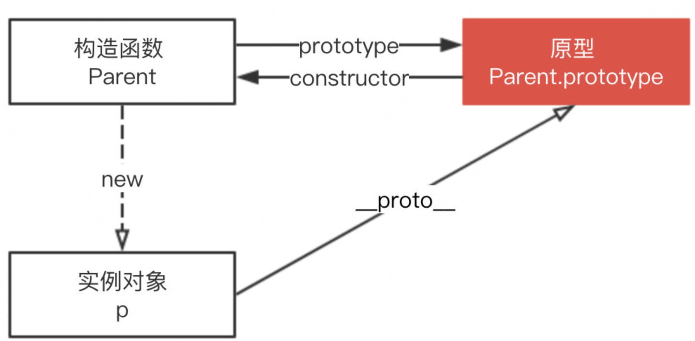

构造函数、原型与实例对象三者之间的关系

#### prototype
每个对象拥有一个原型对象，对象以其原型为模板，**从原型继承方法和属性**，这些属性和方法定义在对象的构造器函数的 prototype 属性上，而非对象实例本身。

#### 原型链
每个对象都拥有一个原型对象，通过`__proto__`指针指向上一个原型，并从中继承方法和属性，同时原型对象也可能拥有原型，这样一层一层，最终指向null，这种关系被称为原型链。

__proto__ 是每个实例上都有的属性，prototype 是构造函数的属性，在实例上并不存在，所以这两个并不一样，但 p.__proto__ 和 Parent.prototype 指向同一个对象。