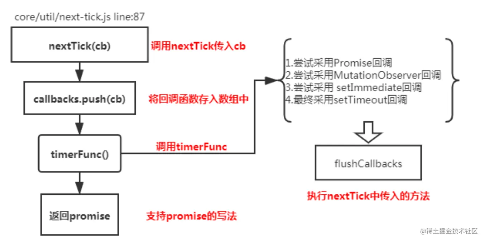
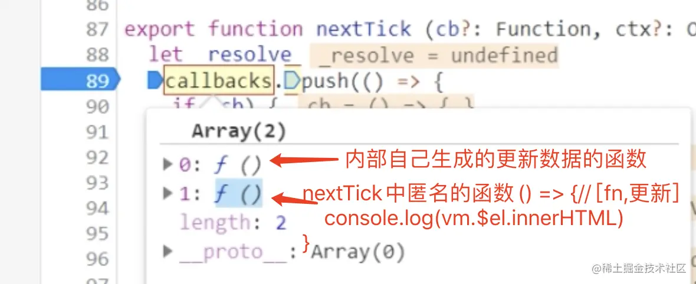

### MVVM的理解
`MVVM` 是 `Model-View-ViewModel `的缩写。`Model` 层代表数据模型，在 `Model` 中定义数据修改和操作的业务逻辑； `View` 代表 `UI` 组件，负责将数据模型转化成 UI 展现出来；`View` 和 `Model` 之间并没有直接的联系，而是通过 `ViewModel` 进行交互， `ViewModel` 通过双向数据绑定把 `View` 层和 `Model` 层连接了起来，而 `View` 和 `Model` 之间的 同步工作完全是自动的，因此开发者只需关注业务逻辑，不需要手动操作 DOM，不需要关注数据状态的同步问题，复杂的数据状态维护完全由 MVVM 来统一管理。


### vue的优点
Vue是一个构建数据驱动视图的渐进式(允许开发者逐步采用Vue的特性和功能)框架。核心是一个响应的数据绑定系统。优点：响应式编程、组件化开发、虚拟DOM；
- 响应式编程

指 Vue 会自动对页面中某些数据的变化做出响应，通过 MVVM 思想实现数据的双向绑定，让开发者不用再操作 DOM 对象，有更多的时间去思考业务逻辑。
- 组件化开发

把一个复杂的单叶应用拆分一个个单独的组件；提高开发的效率、方便重复使用、提升整个项目的可维护性、便于协同开发；
- 虚拟DOM

可以预先通过 JavaScript 进行各种计算，把最终需要操作的DOM计算出来并优化，由于这个 DOM 操作属于预处理操作，并没有真实的操作 DOM，所以叫做虚拟 DOM。最后在计算完毕才真正将 DOM 操作提交，将 DOM 操作变化反映到 DOM 树上；

### Vue2实现双向数据绑定原理是什么
Vue2.x 采用数据劫持结合发布订阅模式（PubSub 模式）的方式，通过 Object.defineProperty 来劫持各个属性的 setter、getter，在数据变动时发布消息给订阅者，触发相应的监听回调。

当把一个普通 Javascript 对象传给 Vue 实例来作为它的 data 选项时，Vue 将遍历它的属性，用 Object.defineProperty 将它们转为 getter/setter。用户看不到 getter/setter，但是在内部它们让 Vue 追踪依赖，在属性被访问和修改时通知变化。
Vue 的数据双向绑定整合了 Observer，Compile 和 Watcher 三者，通过 Observer 来监听自己的 model 的数据变化，通过 Compile 来解析编译模板指令，最终利用 Watcher 搭起 Observer 和 Compile 之间的通信桥梁，达到数据变化->视图更新，视图交互变化（例如 input 操作）->数据 model 变更的双向绑定效果。

### Vue2如何检测数组的变化
Vue2.x 中实现检测数组变化的方法，是将数组的常用方法进行了重写。Vue 将 data 中的数组进行了原型链重写，指向了自己定义的数组原型方法。这样当调用数组 api 时，可以通知依赖更新。如果数组中包含着引用类型，会对数组中的引用类型再次递归遍历进行监控。这样就实现了监测数组变化。

有两种情况无法检测到数组的变化。
1. 当利用索引直接设置一个数组项时，例如 vm.items[indexOfItem] = newValue
```
//使用该方法进行更新视图
// vm.$set，Vue.set的一个别名
vm.$set(vm.items, indexOfItem, newValue)
```
2. 当修改数组的长度时，例如 vm.items.length = newLength
```
//使用该方法进行更新视图
// Array.prototype.splice
vm.items.splice(indexOfItem, 1, newValue)
```

### vue3响应式数据 ------ 这里可能还得深入
- Vue3.x 响应式数据原理是什么？
  在 Vue 2 中，响应式原理就是使用的

  Object.defineProperty 来实现的。但是在 Vue 3.0 中采用了 Proxy，抛弃了 Object.defineProperty 方法。
  究其原因，主要是以下几点：

  1. Object.defineProperty 无法监控到数组下标的变化，导致通过数组下标添加元素，不能实时响应
  2. Object.defineProperty 只能劫持对象的属性，从而需要对每个对象，每个属性进行遍历，如果，属性值是对象，还需要深度遍历。Proxy 可以劫持整个对象，并返回一个新的对象。
  3. Proxy 不仅可以代理对象，还可以代理数组。还可以代理动态增加的属性。
  4. Proxy 有多达 13 种拦截方法
  5. Proxy作为新标准将受到浏览器厂商重点持续的性能优化

- Proxy 只会代理对象的第一层，那么 Vue3 又是怎样处理这个问题的呢？

  判断当前 Reflect.get 的返回值是否为 Object，如果是则再通过 reactive 方法做代理， 这样就实现了深度观测。
- 监测数组的时候可能触发多次 get/set，那么如何防止触发多次呢？

  我们可以判断 key 是否为当前被代理对象 target 自身属性，也可以判断旧值与新值是否相等，只有满足以上两个条件之一时，才有可能执行 trigger。


### v-model双向绑定的原理是什么
v-model 本质就是 :value + input 方法的语法糖。可以通过 model 属性的 prop 和 event 属性来进行自定义。原生的 v-model，会根据标签的不同生成不同的事件和属性。

例如：

1. text 和 textarea 元素使用 value 属性和 input 事件
2. checkbox 和 radio 使用 checked 属性和 change 事件
3. select 字段将 value 作为 prop 并将 change 作为事件

因此接下去我们执行以下 3 个步骤，实现数据的双向绑定：

1. 实现一个监听器 Observer，用来劫持并监听所有属性，如果有变动的，就通知订阅者。
2. 实现一个订阅者 Watcher，可以收到属性的变化通知并执行相应的函数，从而更新视图。
3. 实现一个解析器 Compile，可以扫描和解析每个节点的相关指令，并根据初始化模板数据以及初始化相应的订阅器。


### v-if与v-show的区别
1. 手段
- v-if 是动态的向 DOM 树内添加或者删除 DOM 元素；
- v-show 是通过设置 DOM 元素的 display 样式属性控制显隐

2. 编译过程
- v-if 切换有一个局部编译/卸载的过程，切换过程中合适地销毁和重建内部的事件监听和子组件
- v-show 只是简单的基于 css 切换

3. 编译条件

- v-if 是惰性的，如果初始条件为假，则什么也不做。只有在条件第一次变为真时才开始局部编译
- v-show 是在任何条件下(首次条件是否为真)都被编译，然后被缓存，而且 DOM 元素保留

4. 性能消耗

v-if 有更高的切换消耗；
v-show 有更高的初始渲染消耗

5. 使用场景

v-if 适合运营条件不大可能改变；
v-show 适合频繁切换

### 如何让CSS在当前的组件中起作用
在 vue 文件中的 style 标签上，有一个特殊的属性：scoped。

**scoped的实现原理**

vue中的scoped属性的效果主要通过PostCSS转译实现的，PostCSS给一个组件中的所有DOM添加一个独一无二的动态属性，然后给CSS选择器额外添加一个对应的属性选择器来选择该组件中的DOM，这种做法使得样式只作用于包含有该属性的DOM，即组件内部DOM。
```
<template>
  <div class="example">hi</div>
</template>
<style scoped>
.example {
  color: red;

}
</style>
```
转移后：
```
<template>
  <div class="example" data-v-5558831a>hi</div>
</template>
<style>
.example[data-v-5558831a] {
  color: red;
}
</style>
```

### scoped是如何实现样式穿透的
在很多项目中，引入第三方组件，需要在组件中局部修改第三方组件的样式，而又不想去除scoped属性造成组件之间的样式污染。此时只能通过特殊的方式，穿透scoped。

如下方法来实现样式穿透。

1. 第一种： 使用：：v-deep操作符（>>>的别名）
2. 定义一个含有 scoped 属性的 style 标签之外，再定义一个不含有 scoped 属性的 style 标签，即在一个 vue 组件中定义一个全局的 style 标签，一个含有作用域的 style 标签：
```
<style>
/* global styles */
</style>

<style scoped>
/* local styles */
</style>
```


### keep-alive

keep-alive组件是vue的内置组件，用于缓存内部组件实例。这样做的目的在于，keep-alive内部的组件切回时，不用重新创建组件实例，而直接使用缓存中的实例，一方面能够避免创建组件带来的开销，另一方面可以保留组件的状态。

keep-alive具有include和exclude属性，通过它们可以控制哪些组件进入缓存。

其内部有两个生命周期activated和deactivated


### nextTick的作用时什么？实现原理是什么？

不理解时候看这个文档：**https://blog.csdn.net/qq_24147051/article/details/105774852**

#### 为什么会有nextTick这个东西存在？
因为 vue 采用的异步更新策略，当监听到数据发生变化的时候不会立即去更新DOM，而是开启一个任务队列，并缓存在同一事件循环中发生的所有数据变更;这种做法带来的好处就是可以将多次数据更新合并成一次，减少操作DOM的次数，如果不采用这种方法，假设数据改变100次就要去更新100次DOM，而频繁的DOM更新是很耗性能的；

#### 作用
nextTick 接收一个回调函数作为参数，并将这个回调函数延迟到DOM更新后才执行；

使用场景：想要操作 基于最新数据生成的DOM 时，就将这个操作放在 nextTick 的回调中；

#### 原理
将传入的回调函数包装成异步任务，异步任务又分微任务和宏任务，为了尽快执行所以优先选择微任务；

nextTick 提供了四种异步方法 Promise.then、MutationObserver、setImmediate、setTimeout(fn,0)


**应用场景：**
1. Vue生命周期的created()钩子函数进行DOM操作一定要放在Vue.nextTick()的回调函数中，原因是created钩子函数执行的时候DOM其实病没有进行任何渲染。mounted钩子函数执行时所有的DOM挂载已经完成了。
2. 当项目中你想在改变DOM元素的数据后基于新的dom做点什么，对新DOM一系列的js操作都需要放进Vue.nextTick()的回调函数中；通俗的理解是：更改数据后当你想立即使用js操作新的视图的时候需要使用它。
3. 在使用某个第三方插件时 ，希望在vue生成的某些dom动态发生变化时重新应用该插件，也会用到该方法，这时候就需要在 $nextTick 的回调函数中执行重新应用插件的方法


**原理：**
原因是，Vue是异步执行dom更新的，一旦观察到数据变化，Vue就会开启一个队列，然后把在同一个事件循环 (event loop) 当中观察到数据变化的 watcher 推送进这个队列。如果这个watcher被触发多次，只会被推送到队列一次。这种缓冲行为可以有效的去掉重复数据造成的不必要的计算和DOm操作。而在下一个事件循环时，Vue会清空队列，并进行必要的DOM更新





### 通信
父子组件通信、隔代组件通信、兄弟组件通信

- props / $emit 适用 *父子组件通信*
  - 父组件向子组件传递数据是通过 prop 传递的，子组件传递数据给父组件是通过$emit 触发事件来做到的

**使用：**：主要是用在业务组件之间的通信

- ref 与 $parent / $children(vue3废弃) 适用 *父子组件通信*
  - ref：如果在普通的 DOM 元素上使用，引用指向的就是 DOM 元素；如果用在子组件上，引用就指向组件实例
  - $parent / $children：访问访问父组件的属性或方法 / 访问子组件的属性或方法
**使用：** ref： 主要是想调用子组件内部的方法使用；

EventBus （$emit / $on） 适用于 父子、隔代、兄弟组件通信
  - 这种方法通过一个空的 Vue 实例作为中央事件总线（事件中心），用它来触发事件和监听事件，从而实现任何组件间的通信，包括父子、隔代、兄弟组件；
**使用：** 主要用于组件间的事件通信

- $attrs / $listeners(vue3废弃) 适用于 *隔代组件通信*
  - $attrs：包含了父作用域中不被 prop 所识别 (且获取) 的特性绑定 ( class 和 style 除外 )。当一个组件没有声明任何 prop时，这里会包含所有父作用域的绑定 ( class 和 style 除外 )，并且可以通过 v-bind="$attrs" 传入内部组件。通常配合 inheritAttrs 选项一起使用
  - $listeners：包含了父作用域中的 (不含 .native 修饰器的) v-on 事件监听器。它可以通过 v-on="$listeners" 传入内部组件

- provide / inject 适用于 *隔代组件通信*
  • 祖先组件中通过 provider 来提供变量，然后在子孙组件中通过 inject 来注入变量。 provide / inject API 主要解决了跨级组件间的通信问题， 不过它的使用场景，主要是子组件获取上级组件的状态 ，跨级组件间建立了一种主动提供与依赖注入的关系

- $root 适用于 隔代组件通信 访问根组件中的属性或方法，是根组件，不是父组件。$root只对根组件有用

- Vuex 适用于 父子、隔代、兄弟组件通信
  - Vuex 是一个专为 Vue.js 应用程序开发的状态管理模式。每一个 Vuex 应用的核心就是 store（仓库）。“store” 基本上就是一个容器，它包含着你的应用中大部分的状态 ( state )
  - Vuex 的状态存储是响应式的。当 Vue 组件从 store 中读取状态的时候，若 store 中的状态发生变化，那么相应的组件也会相应地得到高效更新。
  - 改变 store 中的状态的唯一途径就是显式地提交 (commit) mutation。这样使得我们可以方便地跟踪每一个状态的变化。
**使用：** 组件之间共享状态

### vue组件的data为什么必须是函数
组件中的data写成一个函数，数据以函数返回值形式定义。这样每次复用一次组件，就会返回一份新的data，类似于给每个组件实例创建一个私有的数据空间，让各个组件实例维护各自的数据。单纯写成对象形式，就使得组件实例公用一份data，就会造成一个变了全都会变的结果。

### Proxy相比defineProperty的优势在哪里
Object.defineProperty 本身存在的一些问题：
- Object.defineProperty 只能劫持对象属性的 getter 和 setter 方法。
- Object.definedProperty 不支持数组(可以监听数组,不过数组方法无法监听自己重写)，更准确的说是不支持数组的各种 API(所以 Vue 重写了数组方法。

而相比 Object.defineProperty，Proxy 的优点在于：
- Proxy 是直接代理劫持整个对象。
- Proxy 可以直接监听对象和数组的变化，并且有多达 13 种拦截方法。

目前，Object.definedProperty 唯一比 Proxy 好的一点就是兼容性，不过 Proxy 新标准也受到浏览器厂商重点持续的性能优化当中。


### watch与computed的区别是什么
**区别：**

- 都是观察数据变化的（相同）
- 计算属性将会混入到 vue 的实例中，所以需要监听自定义变量；watch 监听 data 、props 里面数据的变化；
- computed 有缓存，它依赖的值变了才会重新计算，watch 没有；
- watch 支持异步，computed 不支持；
- watch 是一对多（监听某一个值变化，执行对应操作）；computed 是多对一（监听属性依赖于其他属性）
- watch 监听函数接收两个参数，第一个是最新值，第二个是输入之前的值；
- computed 属性是函数时，都有 get 和 set 方法，默认走 get 方法，get 必须有返回值（return）

### vue2为什么要求只有一个根元素

**vue2中：**是因为vdom是一个单根树形结构，patch在遍历的时候从根节点开始遍历，它要求只有一个根结点。组件也会转换为一个vdom，自然需要满足这个需求了。

**vue3为什不需要单根节点：**因为引入了Fragment，这是一个抽象的节点，如果发现组件是多根的，就创建一个Fragment节点，把多个根结点作为它的children。等patch的时候，如果发现是一个Fragment节点，就直接便利children创建或更新。


### watch与watchEffect
1. watchEffect是一个立即执行函数，被动的追踪依赖，当这些依赖改变时重新执行该函数。watch检测一个或者多个响应式数据源并在数据源变化时调用一个回调函数。

2. watchEffect在使用时，传入的函数会立即执行一次；watch默认情况下并不会执行回调函数，除非我们手动设置immediate选项。


### vue-loader是什么？
vue-loader是用于处理单文件的webpack的loader；因为有了vue-loader，我们就可以编写单文件格式的Vue组件，可以将代码分割为<template>、<script>和<style>；vue-loader被执行的时候，会对单文件的每个语言都用单独的loader链处理，最后这些单独的块组装成最终的组件模块。

### 怎样处理vue项目中的错误的？
区分是什么错误“接口异常”还是“代码逻辑异常”

接口异常：通常我们会封装Axios，在拦截器中统一处理整个应用中请求的错误。


