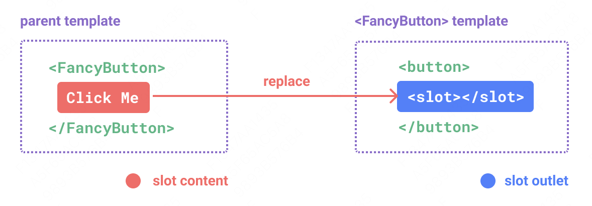
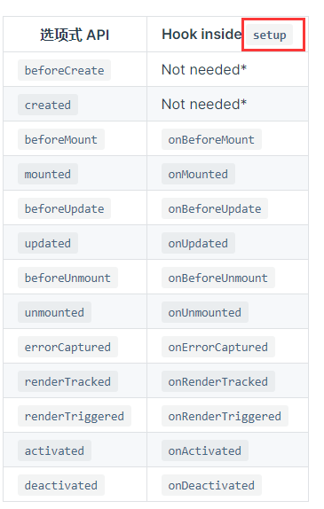

### v-model
数据的双向绑定
#### 原生元素
```
<input v-model="searchText" />
//编译之后
<input
  :value="searchText"
  @input="searchText = $event.target.value"
/>
```
#### 组件
```

//默认是modelValue变量
<CustomInput v-model: modelValue="searchText" />
<CustomInput v-model:XXX="searchText" />

<!-- CustomInput.vue -->
<script>
export default {
  props: ['modelValue'], //props: ['XXX']
  emits: ['update:modelValue'], //emits: ['update:XXX']
}
</script>

<template>
  <input
    :value="modelValue"
    @input="$emit('update:XXX', $event.target.value)"
  />
</template>
```

### ref、reactive
都是响应式Api

1. 差异
ref 对于基本类型和引用类型都可以（对于对象，其还是通过调用reactive()这个方法转换成具有深层次的响应式对象），但是 reactive 只适用于引用类型

2. 数据访问形式不同
对于 ref 来说，无论是原始类型还是对象，访问数据都需要通过 .value 的形式进行，更新数据的话也是通过 .value 的形式；
由于reactive是 proxy 代理的对象数据，你可以直接获取到数据，不必添加 .value

3. 监听方式区别
ref： 对于原始数据类型，watch监听生效，对于引用类型，watch监听生效，需要deep深度监听；
reactive：vue 对其做了优化，使用 watch 监听 reactive 的时候可以不添加 deep 属性，也能够对其做深度监听

4. reactive的局限性
- 仅对对象类型有效（对象、数组和 Map、Set 这样的集合类型），而对 string、number 和 boolean 这样的原始类型无效。
- 因为 Vue 的响应式系统是通过属性访问进行追踪的，如果我们直接“替换”一个响应式对象，这会导致对初始引用的响应性连接丢失：
- 将响应式对象的属性赋值或解构至本地变量，或是将该属性传入一个函数时，会失去响应性


### 插槽
定义：简单来说就是子组件接收父组件模版传递过来的内容。

`<slot>`元素是一个插槽出口，标示父元素提供的插槽内容将在哪里被渲染

```
//home.vue
<test>
     Hello Word
</test>

//test.vue
<a href="#">
	 <slot></slot>
</a>

```

#### 渲染的作用域
插槽内容可以访问到父组件的数据作用域，因为插槽内容本身是在父组件模板中定义的。插槽内容无法访问到子组件的数据。
> 父组件模板中的表达式只能访问父组件的作用域；子组件模板中的表达式只能访问子组件的作用域。

#### 具名插槽
有时候一个组件包含多个插槽出口。这时候需要给插槽命名：
```
<div>
  <header>
    <slot name="header"></slot>
  </header>

  <main>
    <slot></slot>
  </main>

  <footer>
    <slot name="footer"></slot>
  </footer>
</div>
```

```
<div>
   <template v-slot:header>
    <h1>Here might be a page title</h1>
   </template>

  <p>A paragraph for the main content.</p>
  <p>And another one.</p>

  <template v-slot:footer>
    <p>Here some contact info</p>
  </template>
</div>
```

#### 作用域插槽
有时候我们想同时访问父组件域与子组件域的数据， 这时候就需要子组件在渲染时将一部分数据提供给插槽

```
//test.vue
<div>
	<!-- 设置默认值：{{user.lastName}}获取 Jun -->
	<!-- 如果home.vue中给这个插槽值的话，则不显示 Jun -->
	<!-- 设置一个 usertext 然后把user绑到设置的 usertext 上 -->
	<slot v-bind:usertext="user">{{user.lastName}}</slot>
</div>

//定义内容
data(){
  return{
	user:{
	  firstName:"Fan",
	  lastName:"Jun"
	}
  }
}
```

```
//home.vue
<div>
  <test v-slot:default="slotProps">
    {{slotProps.usertext.firstName}}
  </test>
</div>
```

绑定在 <slot> 元素上的特性被称为插槽 prop。在父组件中，我们可以用 v-slot 设置一个值来定义我们提供的插槽 prop 的名字，然后直接使用就好了

### 透传Attributes
####是什么
是指传递给一个组件，却没有被该组件声明为props或emits的 attribute 或v-on监听事件。

#### 对class和style、v-on 监听器继承
一个子组件的根元素已经有了 class 或 style attribute，它会和从父组件上继承的值合并
> 注意⚠️：
透传的 attribute 不会包含组件上声明过的 props 或是针对 emits 声明事件的 v-on 侦听函数，换句话说，声明过的 props 和侦听函数被 <MyButton>“消费”了；

**使用$attrs或useAttrs()接收属性**

### Props
是一个组件用来接受传入的参数；
类型：Number、Boolean、Array、Object

**单项数据流**：所有的props都遵循单项绑定原则，props因父组件的更新而变化；

>需要修改prop的情况有一下两种：
1、prop 被用于传入初始值；而子组件想在之后将其作为一个局部数据属性，这种情况子组件做好定义一个局部数据接受；
2、需要对传入的prop值做进一步的转换。这种情况，最好是基于该prop值定义一个计算属性；
3、当子组件想要更改props的值，最好是抛出一个事件让父组件来更改。

### 计算属性computed

*计算属性*：来描述依赖响应式状态的复杂逻辑；

当获取数据的逻辑过于复杂时，我们可以考虑使用计算属性的方式；

### watch与watchEffect
`watch `和 `watchEffect` 的主要功能是相同的，都能响应式地执行回调函数。它们的区别是追踪响应式依赖的方式不同：
1. `watch` 只追踪明确定义的数据源，不会追踪在回调中访问到的东西；默认情况下，只有在数据源发生改变时才会触发回调；`watch` 可以访问侦听数据的新值和旧值
```
watch(
  () => obj.someObject,
  (newValue, oldValue) => {
    // `newValue` 此处和 `oldValue` 是相等的
    // 除非 obj.someObject 被整个替换了
    console.log('deep', newValue.count, oldValue.count)
  },
  { deep: true }
)
obj.someObject.count++ // deep 1 1
```

2. `watchEffect` 会初始化执行一次，在副作用发生期间追踪依赖，自动分析出侦听数据源；watchEffect无法访问侦听数据的新值和旧值。

```
const url = ref('https://...')
const data = ref(null)
// 一个参数就可以搞定
watchEffect(async () => {
  const response = await fetch(url.value)
  data.value = await response.json()
})
```

### 生命周期


### v-for与v-if
当它们同时存在于一个节点上时，v-if 比 v-for 的优先级更高。这意味着 v-if 的条件将无法访问到 v-for 作用域内定义的变量别名：

```
<!--
 这会抛出一个错误，因为属性 todo 此时
 没有在该实例上定义
-->
<li v-for="todo in todos" v-if="!todo.isComplete">
  {{ todo.name }}
</li>
```

### v-if与v-show
v-if支持在<template>上使用，v-show不支持