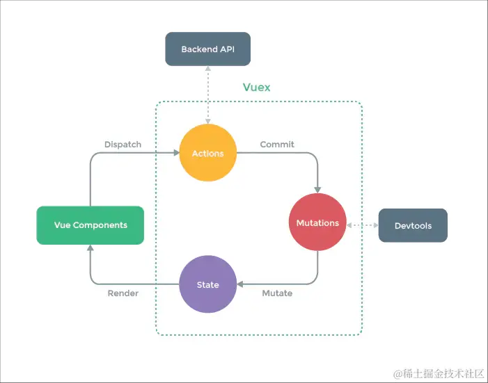

Vuex是专门为vue设计的状态管理工具。
- Vue Components 负责接收用户操作交互行为，执行dispatch触发对应的action进行回应
- dispatch唯一能执行action的方法
- action用来接收components的交互行为，包含异步同步操作
- commit对mutation进行提交，唯一能执行mutation的方法
- mutation唯一可以修改state状态的方法
- state页面状态管理容器，用于存储状态
- getters读取state方法

Vue组件接收交互行为，调用dispatch方法触发action相关处理，若页面状态需要改变，则调用commit方法提交mutation修改state，通过getters获取到state新值，重新渲染Vue Components，界面随之更新。

Vuex中action和mutation的区别
- mutation更专注于修改state，必须是同步执行。
- action提交的是mutation，而不是直接更新数据，可以是异步的，如业务代码，异步请求。
- action可以包含多个mutation

### Vuex和localStorage的区别
- Vuex是响应式的，localstorage需要刷新

