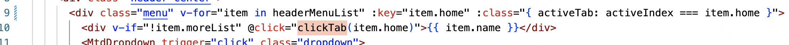
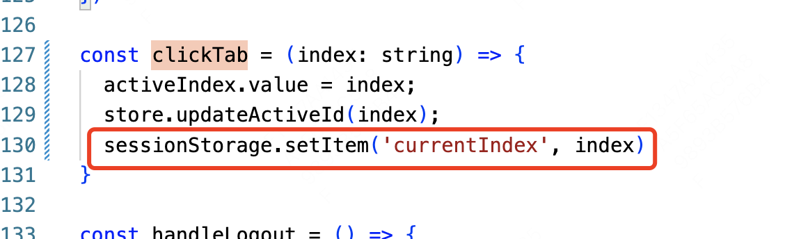
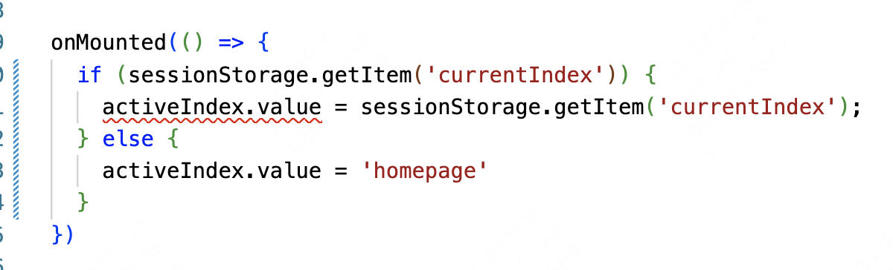

##### 问题：
vue开发中，当刷新页面时，导航栏显示高亮的位置会自动变为第一个，这是因为，会重新执行代码，我们代码中默认显示第一个。

##### 解决

当促发点击事件的时候，将下标用`sessionStorage`保存

在onMounted中进行判断

在登陆组件或者app.vue组件中清楚相应的储存
`sessionStorage.removeItem('currentIndex');`