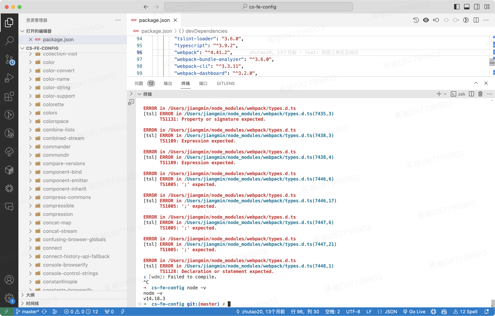

运行npm run dev对node_modules文件下进行了ts的检测


这是因为在配置tsconfig.json的时候，虽然配置了exclude，但是还是对node_modules进行了检测，需要在配置include

```
{
  "compileOnSave": false,
  "compilerOptions": {
    "allowJs": true,
    "module": "esnext",
    "emitDecoratorMetadata": true,
    "experimentalDecorators": true,
    "moduleResolution": "node",
    "noImplicitAny": false,
    "removeComments": false,
    "suppressImplicitAnyIndexErrors": true,
    "downlevelIteration": true,
    "sourceMap": true,
    "baseUrl": "src",
    "paths": {
      "@components/*": ["app/components/*"]
    },
    "typeRoots": [
      "node_modules/@types"
    ],
    "target": "es5",
    "lib": [
      "dom",
      "es5",
      "es6",
      "es7",
      "es2017",
      "scripthost"
    ]
  },
  <!-- 排除 -->
  "exclude": [
    "vendor",
    "node_modules",
    "typings"
  ],
  <!-- 只对某些文件进行检测 -->
  "include": ["src"],

  双层的保障
}

```


参考的解决： https://blog.csdn.net/weixin_40795574/article/details/123424592