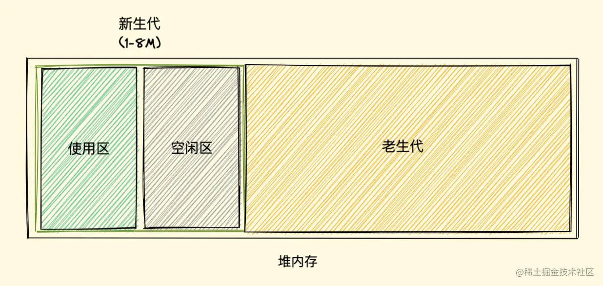

### 浏览器的垃圾回收机制

Javascript垃圾回收机制说白了就是定期（实时的话开销太大）找出那些不在用到的变量，然后释放其内存。

#### 标记清除算法
大致过程如下：
- 垃圾收集器在运行时会给内存中的所有变量都加上一个标记，假设内存中所有对象都是垃圾，全标记为0；
- 然后从各个根对象开始遍历，把不是垃圾的节点改为1
- 清除所有标记为0的垃圾，销毁并回收它们所占用的内存空间
- 最后，把所有内存中对象标记修改为0，等待下一轮垃圾回收

**优点：** 实现比较简单，打标记也无非打与不打两种情况，这使得一位二进制位（0和1）就可以为其标记

**缺点：** ：清除之后剩余的对象位置不变而导致的空闲内存不连续
 - 内存碎片化：空闲内存是不连续的，容易出现很多空闲内存快，还可能出现分配所需内存过大的对象找不大合适的快
 - 分配速度慢：需要不停的遍历，找到合适的内存快，来分配内存。

 标记整理（Mark-Compact）算法 就可以有效地解决，它的标记阶段和标记清除算法没有什么不同，只是标记结束后，标记整理算法会将活着的对象（即不需要清理的对象）向内存的一端移动，最后可用内存就变的连续了

#### 引用计数算法
引用计数：它把对象是否不再需要简化定义为对象有没有其他对象引用它，如果没有引用指向该对象，对象将被垃圾回收机制回收。它的策略是跟踪记录每个变量被引用的次数。
- 当声明了一个变量并且将一个引用类型赋值给该变量的时候这个值的引用次数就为 1
- 如果同一个值又被赋给另一个变量，那么引用数加 1
- 如果该变量的值被其他的值覆盖了，则引用次数减 1
- 当这个值的引用次数变为 0 的时候，说明没有变量在使用，这个值没法被访问了，回收空间，垃圾回收器会在运行的时候清理掉引用次数为 0 的值占用的内存

循环引用问题：
```
function test(){
  let A = new Object()
  let B = new Object()

  A.b = B
  B.a = A
}

```

#### 分代式垃圾回收
分代式垃圾回收将堆内存分为新生代和老生代两区域，采用不同的垃圾回收器也就是不同的策略管理垃圾回收。

新生代的对象为存活时间较短的对象，简单来说就是新产生的对象，通常只支持 1～8M 的容量，而老生代的对象为存活事件较长或常驻内存的对象，简单来说就是经历过新生代垃圾回收后还存活下来的对象，容量通常比较大



##### 新生代垃圾回收
新生代区域分为：使用区和空闲区

新加入的对象都会放在使用区，当使用区快被写满时，就需要执行一次垃圾处理操作；当开始进行垃圾回收时，新生代垃圾回收器会对使用区中的活动对象做标记，标记完成之后将使用区的活动对象复制进空闲区并进行排序，随后进入垃圾清理阶段，即将非活动对象占用的空间清理掉。最后进行角色互换，把原来的使用区变成空闲区，把原来的空闲区变成使用区

当一个对象经过多次复制后依然存活，它将会被认为是生命周期较长的对象，随后会被移动到老生代中，采用老生代的垃圾回收策略进行管理

##### 老生代垃圾回收
老生代shying的就是标记清除算法进行垃圾清除

简单描述一下这个过程

首先新生代分使用区和空闲区，当使用区快满了，就要开始GC了
然后开始对使用区做标记，标记后复制一份活动对象到空闲区（这里做了整理的操作，也就是排序，避免内存碎片）
再然后清除使用区数据对象，把原来的使用区改称空闲区，把原来的空闲区改成使用区，这样的话新使用区就是空的，继续存数据，当快存满了开始下一轮GC

再看第二轮GC，还是重复上面的步骤，先标记，再把活动对象从使用区复制到空闲区，这个时候假如发现了上次就存在的对象这次还是活动对象，那这个对象就会被晋级，扔到老生代里去。接着说复制之后，使用区又被清空了，并且再次和空闲区转换，那每一轮GC过后，使用区就会变成空的