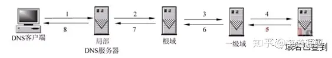
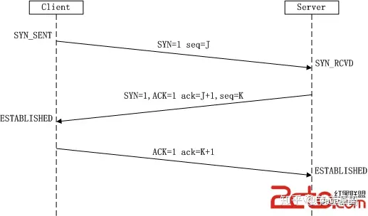
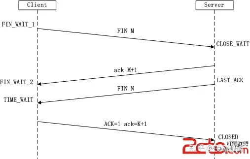

### `localStorage`、`sessionStorage`、`cookie`、`session`

#### cookie
cookie就是客服端保存用户信息的一种机制，用来记录用户的一些信息。因为HTTP是一种无状态的协议，服务器单从网络连接上无法知道客户身份的，这个时候服务器就需要给客户颁发一个cookie，用来确认用户的身份。
> 原理：web服务器通过在http响应消息头增加Set-Cookie响应头字段将Cookie信息发送给浏览器，浏览器则通过在http请求消息中增加Cookie请求头字段将Cookie回传给web服务器。

**cookie是不可跨域的   保存在客服端的浏览器中**

#### session
Session是另一种记录客户状态的机制，不同的是Cookie保存在客户端浏览器中，而Session保存在服务器上。客户端浏览器访问服务器的时候，服务器把客户端信息以某种形式记录在服务器上，这就是Session。客户端浏览器再次访问时只需要从该Session中查找该客户的状态就可以了。每个用户访问服务器都会建立一个session并自动分配一个SessionId，用于标识用户的唯一身份。

session 的运行依赖 session id，而 session id 是存在 cookie 中的，也就是说，如果浏览器禁用了 cookie ，同时 session 也会失效（但是可以通过其它方式实现，比如在 url 中传递 session_id）

#### session与cookie的区别
- Cookie数据存放在客服端，Session数据存放在服务端（放在服务器的一个文件里）；
- session比cookie的安全性更高；
- 单个cookie数据不能超过4k，session原则上没有限制；

#### `localStorage`
- `localStorage` 是一个持久化的存储机制，存储的数据没有过期时间，除非被显式删除，否则会一直存在。存放数据大小为5MB。
- `localStorage` 存储的数据是基于域名的，同一个域名下的页面可以访问相同的 localStorage 数据。不跨域。
- `localStorage` 使用简单，可以通过`localStorage.setItem(key, value)`来设置数据，通过`localStorage.getItem(key)`来获取数据。


#### `sessionStorage`：
- `sessionStorage` 是一个会话级别的存储机制，存储的数据在会话结束后会被清除，即当用户关闭浏览器窗口时，`sessionStorage `中的数据会被删除。存放数据大小为5MB。
- `sessionStorage` 存储的数据只在同一个窗口或标签页中共享，不同窗口或标签页之间的 `sessionStorage`数据是隔离的。
- `sessionStorage` 也是基于域名的，同一个域名下的页面可以访问相同的 `sessionStorage` 数据。
- `sessionStorage` 的使用方式与 `localStorage` 类似，可以通过 `sessionStorage.setItem(key, value)` 来设置数据，通过 `sessionStorage.getItem(key)` 来获取数据。


#### localStorage与sessionStorage的区别
- localStorage生命周期是永久的，除非被清除，否则永久保存，而sessionStorage仅在当前会话下有效，关闭页面或浏览器后被清除


#### localStorage与sessionStorage的相同点
- 两种方式存放数据大小为5MB，并且仅在客户端中保存不参与和服务器通信。


需要注意的是，无论是 `localStorage` 还是 `sessionStorage`，存储的数据都是以字符串的形式存储的。如果需要存储其他类型的数据，可以使用 `JSON.stringify()` 将其转换为字符串进行存储，再使用 `JSON.parse()` 将其转换回原始类型。


### 从地址栏输入地址到页面显示出来，发生了什么？
https://blog.csdn.net/XH_jing/article/details/106066947

#### 简单版本
- 浏览器根据请求的URL交给DNS进行域名解析，找到真实IP地址，向服务器发起请求；
- 服务器处理完成后返回数据，浏览器接受文件(HTML、CSS、JS、images等)
- 浏览器对加载到的资源进行语法解析
- 载入解析到的资源文件，完成页面的渲染。


#### 详细版本
1. 浏览器查看缓存
  - 如果资源未缓存，发起新的请求；
  - 如果已缓存，检查是否足够新鲜，足够新鲜直接提供给客户端，否则与服务器进行验证；
  - 检验新鲜通常有两个HTTP头进行控制Expires和Cache-Control：
    - HTTP1.0 提供Expires，值为一个绝对时间表示缓存新鲜日期
    - HTTP1.1 增加了Cache-Control:max-age=，值为以秒为单位的最大新鲜时间；

2. 浏览器解析URL获取协议，主机、端口号、path；
3. 浏览器组装一个HTTP请求报文；
4. 浏览器获取主机IP地址
5. 打开一个socket与目标IP地址，建立TCP链接，三次握手：
  - 客户端发送一个TCP的SYN=1,Seq=X 的包到服务器端口
  - 服务器发回SYN=1,ACK=X+1,Seq=Y 的响应包
  - 客户端发送 ACK=Y+1,Seq=Z
6. TCP链接建立后发送HTTP请求
7. 服务器接受请求并解析
8. 服务器检查HTTP请求是否包含缓存验证信息，如果缓存新鲜，返回304等对应状态码
9. 处理程序读取完整请求并准备HTTP响应
10. 服务器将响应报文通过TCP连接发送回浏览器
11. 浏览器接收HTTP响应，并关闭TCP连接的四次握手：
 - 主动方发送Fin=1,Ack=Z,Seq=X报文
 - 被动方发送Ack=X+1,Seq=Z报文
 - 被动方发送Fin=1,Ack=X,Seq=Y报文
 - 主动方发送Ack=Y,Seq=X报文
12. 浏览器检查响应状态码：是否为 1xx，3xx，4xx，5xx，这些情况处理与2xx不同
13. 如果资源可缓存，进行缓存
14. 对响应进行解码（比如gzip压缩）
15. 根据资源类型决定如何处理
16. 解析HTML文档，构建DOM树，下载资源，构造CSSOM树，执行js脚本，这些操作没有严格的先后顺序，
17. 显示页面

#### 详细及拓展版本
1. 浏览器查看缓存
  - 如果资源未缓存，发起新的请求；
  - 如果已缓存，检查是否足够新鲜，足够新鲜直接提供给客户端，否则与服务器进行验证；
  - 检验新鲜通常有两个HTTP头进行控制Expires和Cache-Control：
    - HTTP1.0 提供Expires，值为一个绝对时间表示缓存新鲜日期
    - HTTP1.1 增加了Cache-Control:max-age=，值为以秒为单位的最大新鲜时间；

2. 浏览器解析URL获取协议，主机、端口号、path；
3. 浏览器组装一个HTTP请求报文；
4. 浏览器获取主机IP地址
  + 浏览器首先会查看本地硬盘的hosts文件；
  + 如果本地的hosts文件没有找到对应的ip地址，浏览器会发出一个DNS请求到本地的DNS服务器 - 局部服务器(中国移动、中国电信)
  + 本地DNS服务器 -》 根DNS服务器。
  + 根DNS服务器 -》域服务器

  **什么是DNS：**域名系统
   
   DNS查询的两种方式：递归查询和迭代查询
   - 递归查询：一层一层递归下去
   
   - 迭代查询： 迭代解析只是帮你找到相关的服务器而已，而不会帮你去查

   **DNS负载均衡**：在DNS服务器中为同一个主机名配置多个IP地址，在应答DNS查询时，DNS服务器对每个查询将以DNS文件中主机记录的IP地址顺序返回不同的解析结果，将客户端的访问引导到不同的机器上去，使得不同的客户端访问到不同的服务器，从而达到负载均衡。（我们针对同一个域名设置多条A记录，指向不同的IP地址。当用户当问时，DNS服务器就会根据权重或者地理位置为用户返回不同的IP）这样就实现了对访问流量的分摊，既减轻了单个服务器的负载压力，也提升了用户的访问速度

5. 打开一个socket与目标IP地址，建立TCP链接，三次握手：
  - 客户端发送一个TCP的SYN=1,Seq=X 的包到服务器端口
  - 服务器发回SYN=1,ACK=X+1,Seq=Y 的响应包
  - 客户端发送 ACK=Y+1,Seq=Z

  **SYN**： 是TCP连接建立过程中的同步标志。
  **ACK**： 是TCP连接中的确认标志。
  **FIN**： 是TCP连接的终止标志。
  **Seq**：是TCP报文段中的序列号字段。序列号的作用是保证数据的有序传输和重组。

  **三次握手详解：**
    - **第一次握手：** 客户端A将标志位SYN置为1,随机产生一个值为seq=J（J的取值范围为=1234567）的数据包到服务器，客户端A进入SYN_SENT状态，等待服务端B确认；
    - **第二次握手：** 服务端B收到数据包后由标志位SYN=1知道客户端A请求建立连接，服务端B将标志位SYN和ACK都置为1，ack=J+1，随机产生一个值seq=K，并将该数据包发送给客户端A以确认连接请求，服务端B进入SYN_RCVD状态。
    - **第三次握手：** 客户端A收到确认后，检查ack是否为J+1，ACK是否为1，如果正确则将标志位ACK置为1，ack=K+1，并将该数据包发送给服务端B，服务端B检查ack是否为K+1，ACK是否为1，如果正确则连接建立成功，客户端A和服务端B进入ESTABLISHED状态，完成三次握手，随后客户端A与服务端B之间可以开始传输数据了。

    

    **为什么需要三次握手：** 为了防止已失效的连接请求报文段突然又传送到了服务端，因而产生错误。

    **已失效的连接请求报文段** 的产生在这样一种情况下：client发出的第一个连接请求报文段并没有丢失，而是在某个网络结点长时间的滞留了，以致延误到连接释放以后的某个时间才到达server。本来这是一个早已失效的报文段。但server收到此失效的连接请求报文段后，就误认为是client再次发出的一个新的连接请求。于是就向client发出确认报文段，同意建立连接。

    **不采用“三次握手”** ：那么只要server发出确认，新的连接就建立了。由于现在client并没有发出建立连接的请求，因此不会理睬server的确认，也不会向server发送数据。但server却以为新的运输连接已经建立，并一直等待client发来数据。这样，server的很多资源就白白浪费掉了。采用“三次握手”的办法可以防止上述现象发生。例如刚才那种情况，client不会向server的确认发出确认。server由于收不到确认，就知道client并没有要求建立连接。”。主要目的防止server端一直等待，浪费资源。

    **为什么建立连接是三次握手，而关闭连接却是四次挥手呢？**

    因为握手的时候并没有数据传输，所以服务端的SYN和ACK报文可以一起发送，但是挥手的时候有数据的传输，所以ACK和FIN报文不能同时发送，需要分两步

    因为当Server端收到Client端的SYN连接请求报文后，可以直接发送SYN+ACK报文。其中ACK报文是用来应答的，SYN报文是用来同步的。但是关闭连接时，当Server端收到FIN报文时，很可能并不会立即关闭SOCKET，所以只能先回复一个ACK报文，告诉Client端，"你发的FIN报文我收到了"。只有等到我Server端所有的报文都发送完了，我才能发送FIN报文，因此不能一起发送。故需要四步握手。

    **为什么客户端在第四次挥手后还会等待 2MSL？** 等待 2MSL 是因为保证服务端接收到了 ACK 报文，因为网络是复杂了，很有可能 ACK 报文丢失了，如果服务端没接收到 ACK 报文的话，会重新发送 FIN 报文，只有当客户端等待了 2MSL 都没有收到重发的 FIN 报文时就表示服务端是正常收到了 ACK 报文，那么这个时候客户端就可以关闭了。

    **三次握手：C与S**
    - C：我要给你发数据了
    - S：好的，我准备好了，你发吧
    - C：好的，收到

    **四次挥手：C与S**
    - C：我的数据发完了
    - S：好的，我听到了，我看看收完了没
    - S：好的，已经收完了，你关闭吧
    - C：好的，已经关闭了


6. TCP链接建立后发送HTTP请求
  **请求信息包括三个部分：**
    - 请求方式URI协议/版本
    - 请求头
    - 请求正文

  ```
  GET/sample.jspHTTP/1.1
  Accept:image/gif.image/jpeg,*/*
  Accept-Language:zh-cn
  Connection:Keep-Alive
  Host:localhost
  User-Agent:Mozila/4.0(compatible;MSIE5.01;Window NT5.0)
  Accept-Encoding:gzip,deflate

  username=jinqiao&password=1234
  ```
7. 服务器接受请求并解析
8. 服务器检查HTTP请求是否包含缓存验证信息，如果缓存新鲜，返回304等对应状态码
9. 处理程序读取完整请求并准备HTTP响应
  **HTTP响应也由三部分构成：**
    - 状态行：协议版本、数字形式的状态代码、及相应的状态描述，各元素之间以空格分隔。
    - 响应头
    - 响应正文

10. 服务器将响应报文通过TCP连接发送回浏览器
11. 浏览器接收HTTP响应，并关闭TCP连接的四次握手：
 - 主动方发送Fin=1,Ack=Z,Seq=X报文
 - 被动方发送Ack=X+1,Seq=Z报文
 - 被动方发送Fin=1,Ack=X,Seq=Y报文
 - 主动方发送Ack=Y,Seq=X报文

  **四次挥手详解：**
  - 第一次挥手： Client发送一个FIN，用来关闭Client到Server的数据传送，Client进入FIN_WAIT_1状态。
  - 第二次挥手： Server收到FIN后，发送一个ACK给Client，确认序号为收到序号+1（与- SYN相同，一个FIN占用一个序号），Server进入CLOSE_WAIT状态。
  - 第三次挥手： Server发送一个FIN，用来关闭Server到Client的数据传送，Server进入LAST_ACK状态。
  - 第四次挥手： Client收到FIN后，Client进入TIME_WAIT状态，接着发送一个ACK给Server，确认序号为收到序号+1，Server进入CLOSED状态，完成四次挥手。
  

12. 浏览器检查响应状态码：是否为 1xx，3xx，4xx，5xx，这些情况处理与2xx不同
  1xx：信息性状态码，表示服务器已接收了客户端请求，客户端可继续发送请求。
  - 100 Continue
  - 101：表示服务器已经接受了客户端的协议升级请求，并且将切换到不同的协议进行通信。

  2xx：成功状态码，表示服务器已成功接收到请求并进行处理。
  - 200 OK 表示客户端请求成功
  - 204 No Content 成功，但不返回任何实体的主体部分
  - 206 Partial Content 成功执行了一个范围（Range）请求

  3xx：重定向状态码，表示服务器要求客户端重定向。
  - 301 Moved Permanently 永久性重定向，响应报文的Location首部应该有该资源的新URL
  - 302 Found 临时性重定向，响应报文的Location首部给出的URL用来临时定位资源
  - 303 See Other 请求的资源存在着另一个URI，客户端应使用GET方法定向获取请求的资源
  - 304 Not Modified 服务器内容没有更新，可以直接读取浏览器缓存
  - 307 Temporary Redirect 临时重定向。与302 Found含义一样。302禁止POST变换为GET，但实际使用时并不一定，307则更多浏览器可能会遵循这一标准，但也依赖于浏览器具体实现

  4xx：客户端错误状态码，表示客户端的请求有非法内容。
  - 400 Bad Request 表示客户端请求有语法错误，不能被服务器所理解
  - 401 Unauthonzed 表示请求未经授权，该状态代码必须与 WWW-Authenticate 报头域一起使用
  - 403 Forbidden 表示服务器收到请求，但是拒绝提供服务，通常会在响应正文中给出不提供服务的原因
  - 404 Not Found 请求的资源不存在，例如，输入了错误的URL

  5xx：服务器错误状态码，表示服务器未能正常处理客户端的请求而出现意外错误。
  - 500 Internel Server Error 表示服务器发生不可预期的错误，导致无法完成客户端的请求
  - 503 Service Unavailable 表示服务器当前不能够处理客户端的请求，在一段时间之后，服务器可能会恢复正常
13. 如果资源可缓存，进行缓存
14. 对响应进行解码（比如gzip压缩）
15. 根据资源类型决定如何处理
16. 解析HTML文档，构建DOM树，下载资源，构造CSSDOM树，执行js脚本，这些操作没有严格的先后顺序
 解析html以构建dom树 -》 构建render树 -》 布局render树 -》 绘制render树

浏览器在解析html文件时，会“自上而下”加载，并在加载过程中进行解析渲染。如在解析过程中遇到外部资源时会进行一步的处理（图片，外链css等），不会影响html文档进行加载。（但是遇到js，html会挂起渲染的县城，不仅要等到js文件加载完毕，才可以恢复html文档的渲染线程。因为JS有可能会修改DOM，最为经典的document.write，这意味着，在JS执行完成前，后续所有资源的下载可能是没有必要的，这是js阻塞后续资源下载的根本原因。所以我明平时的代码中，js是放在html文档末尾的。）

解析过程中，浏览器首先会解析HTML文件构建DOM树，然后解析CSS文件构建渲染树，等到渲染树构建完成后，浏览器开始布局渲染树并将其绘制到屏幕上。这个过程涉及到reflow（回流）和repain（重绘）

JS的解析是由浏览器中的JS解析引擎完成的，比如谷歌的是V8。JS是单线程运行，也就是说，在同一个时间内只能做一件事，所有的任务都需要排队，前一个任务结束，后一个任务才能开始。但是又存在某些任务比较耗时，如IO读写等，所以需要一种机制可以先执行排在后面的任务，这就是：同步任务(synchronous)和异步任务(asynchronous)。

JS的执行机制就可以看做是一个主线程加上一个任务队列(task queue)。同步任务就是放在主线程上执行的任务，异步任务是放在任务队列中的任务。所有的同步任务在主线程上执行，形成一个执行栈;异步任务有了运行结果就会在任务队列中放置一个事件；脚本运行时先依次运行执行栈，然后会从任务队列里提取事件，运行任务队列中的任务，这个过程是不断重复的，所以又叫做事件循环(Event loop)。

17. 显示页面


### 什么是同源策略
同源是指：协议、端口号、域名必须一致。

  #### 如何解决跨域问题
    待解决。。。。。。。。。。。。。。。。

### 重排（回流）和重绘的区别
**重排（回流）：** 当渲染树中部分或者全部元素的尺寸、结构或者某些属性发生改变时，浏览器重新渲染部分或者全部文档的过程
 - 页面首次渲染
 - 浏览器窗口大小发生改变
 - 元素尺寸或位置发生改变
 - 元素内容变化（文字数量或图片大小等）
 - 元素字体大小变化
 - 添加或者删除可见的 DOM 元素
 - 激活 CSS 伪类（:hover）
 - 设置 style 属性
 - 查询某些属性或调用某些方法

**重绘：** 当页面元素样式的改变并不影响他在文档流中的位置，只影响元素的外观、风格，而不会影响布局，浏览器会讲新样式赋予给元素并重新绘制它。
 - 字体颜色改变
 - 边框样式改变
 - 背景颜色、图片、定位、尺寸改变
 - 外边框颜色、样式
 - 外发光改变

 **如何避免触发回流或者重绘：**
 - 使用CSS的transform属性进行动画效果：使用transform属性进行平移、旋转、缩放等动画效果，而不是修改元素的位置和尺寸。因为transform属性不会触发回流，只会触发重绘，性能更高
 - 使用虚拟DOM：虚拟DOM会将多次DOM操作合并为一次操作，然后在进行最小化的重排和重绘。
 - 使用 display: none 做DOM离线处理，减少回流重绘次数
 - 对于 resize、scroll等进行防抖/节流处理


### 事件流
事件流分为三个阶段：捕获阶段、目标阶段、冒泡阶段

1. 捕获阶段：事件从最外层的节点，也就是文档对象开始，逐级向下传播，直到事件的目标节点上。
2. 目标阶段：事件到达目标节点，触发目标节点上的事件处理函数。
3. 冒泡阶段：事件从目标节点开始，逐级向上传播，直到到达最外层节点（文档对象）

 - 冒泡事件：是指子元素向父元素传递的过程（从里到外）
 - 捕获事件：是指父元素向子元素传递的过程（从外到里）

阻止冒泡、捕获：e.stopPropagation()（只会阻止冒泡或者捕获）; 或e.stopImmediatePropagation()（还会阻止同一个元素上后续绑定的相同类型的事件处理程序的执行）

事件委托：是利用事件冒泡机制的技术，通过将事件处理程序绑定到父元素上，来处理子元素上触发的事件。

```
<ul id="parent-list">
  <li>Item 1</li>
  <li>Item 2</li>
  <li>Item 3</li>
  <li>Item 4</li>
</ul>

// 获取父元素
const parentList = document.getElementById('parent-list');

// 事件委托，将事件处理程序绑定到父元素上
parentList.addEventListener('click', function(event) {
  // 判断事件源是否为子元素
  if (event.target.tagName === 'LI') {
    // 执行相应的操作
    console.log('Clicked on item:', event.target.textContent);
  }
});
```

