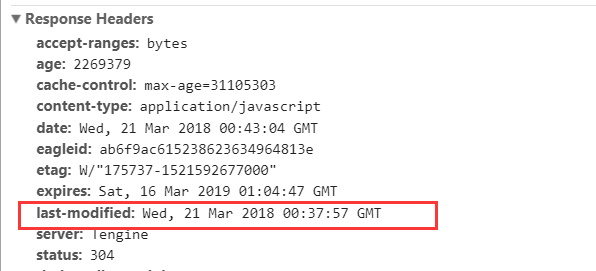

### 浏览器的缓存
浏览器的缓存机制也就是我们说的HTTP缓存机制，是根据HTTP报文的缓存标识进行的。

通用信息头指的是请求和响应报文都支持的头域，分别为Cache-Control、Connection、Date、Pragma、Transfer-Encoding、Upgrade、Via；实体头则是实体信息的实体头域，分别为Allow、Content-Base、Content-Encoding、Content-Language、Content-Length、Content-Location、Content-MD5、Content-Range、Content-Type、Etag、Expires、Last-Modified、extension-header。这里只是为了方便理解，将通用信息头，响应头/请求头，实体头都归为了HTTP头。

#### 缓存过程分析
浏览器与服务器通信的方式为应答模式，即是：浏览器发起HTTP请求 – 服务器响应该请求。那么浏览器第一次向服务器发起该请求后拿到请求结果，会根据响应报文中HTTP头的缓存标识，决定是否缓存结果，是则将请求结果和缓存标识存入浏览器缓存中。

- 浏览器每次发起请求，都会先在浏览器缓存中查找该请求的结果以及缓存标识
- 浏览器每次拿到返回的请求结果都会将该结果和缓存标识存入浏览器缓存中

根据是否需要想服务器重新发起HTTP请求将缓存过程分为两个部分：强制缓存和协商缓存。

#### 强制缓存
强缓存就是向浏览器缓存查找该请求结果，并根据该结果的缓存规则来决定是否使用该缓存的结果的过程，强缓存主要分为三种情况：
 1. 不存在该缓存结果和缓存标识，强制缓存失效，则直接向服务器发起请求（跟第一次发起请求一致）
 2. 存在该缓存结果和缓存标识，但该结果已失效，强制缓存失效，则使用协商缓存
 3. 存在该缓存结果和缓存标识，且该结果尚未失效，强制缓存生效，直接返回该结果

当浏览器向服务器发起请求时，服务器会将缓存规则放入HTTP响应报文的HTTP头中和请求结果一起返回给浏览器，控制强制缓存的字段分别是Expires和Cache-Control，其中Cache-Control优先级比Expires高。

##### Expires
在http/1.0中是Expires控制缓存的字段，如果客户端的时间小于Expires的值时，直接使用缓存结果；

在http/1.1中是Cache-Control字段控制，因为Expires控制缓存的原理是使用客户端的时间与服务端返回的时间做对比，那么如果客户端与服务端的时间因为某些原因（例如时区不同；客户端和服务端有一方的时间不准确）发生误差，那么强制缓存则会直接失效，这样的话强制缓存的存在则毫无意义。

##### Cache-Control
在HTTP/1.1中，Cache-Control是最重要的规则，主要用于控制网页缓存，主要取值为：
- public：所有内容都将被缓存（客户端和代理服务器都可缓存）
- private：所有内容只有客户端可以缓存，Cache-Control的默认取值
- no-cache：客户端缓存内容，但是是否使用缓存则需要经过协商缓存来验证决定
- no-store：所有内容都不会被缓存，即不使用强制缓存，也不使用协商缓存
- max-age=xxx (xxx is numeric)：缓存内容将在xxx秒后失效

 - HTTP响应报文中expires的时间值，是一个绝对值
 - HTTP响应报文中Cache-Control为max-age=600，是相对值

 由于Cache-Control的优先级比expires，那么直接根据Cache-Control的值进行缓存，意思就是说在600秒内再次发起该请求，则会直接使用缓存结果，强制缓存生效。

 优先从内存取，其次是硬盘。

#### 协商缓存
协商缓存就是强制缓存失效后，浏览器携带缓存标识向服务器发起请求，由服务器根据缓存标识决定是否使用缓存的过程

1. 协商缓存生效，返回304:

2. 协商缓存失效，返回200和请求结果:

协商缓存字段：Last-Modified / If-Modified-Since和Etag / If-None-Match，其中Etag / If-None-Match的优先级比Last-Modified / If-Modified-Since高

##### Last-Modified / If-Modified-Since
Last-Modified 是服务器响应请求时，返回该资源文件在服务器最后被修改的时间

If-Modified-Since则是客户端再次发起该请求时，携带上次请求返回的Last-Modified值，通过此字段值告诉服务器该资源上次请求返回的最后被修改时间。服务器收到该请求，发现请求头含有If-Modified-Since字段，则会根据If-Modified-Since的字段值与该资源在服务器的最后被修改时间做对比，若服务器的资源最后被修改时间大于If-Modified-Since的字段值，则重新返回资源，状态码为200；否则则返回304，代表资源无更新，可继续使用缓存文件，

##### Etag/If-None-Match
Etag是服务器响应请求时，返回当前资源文件的一个唯一标识(由服务器生成)

If-None-Match是客户端再次发起该请求时，携带上次请求返回的唯一标识Etag值，通过此字段值告诉服务器该资源上次请求返回的唯一标识值。服务器收到该请求后，发现该请求头中含有If-None-Match，则会根据If-None-Match的字段值与该资源在服务器的Etag值做对比，一致则返回304，代表资源无更新，继续使用缓存文件；不一致则重新返回资源文件，状态码为200

#### 总结
强缓存优先于协商缓存，若强制缓存（Expires和Cache-Control）生效则直接使用缓存，若不生效则进行协商缓存(Last-Modified / If-Modified-Since和Etag / If-None-Match)，协商缓存由服务器决定是否使用缓存，若协商缓存失效，那么代表该请求的缓存失效，重新获取请求结果，再存入浏览器缓存中；生效则返回304，继续使用缓存
